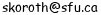

# Sajin Koroth's home page 

## About Me

I am a postdoctoral researcher at [Simon Fraser University](http://www.cs.sfu.ca) hosted by [Valentine Kabanets](http://www.cs.sfu.ca/~kabanets/). 
I am interested in Complexity Theory. More specifically, I am interested in circuit complexity and communication complexity and the interplay between these two seemingly different areas.

### I am the organizer for the [theory seminar](http://www.sfu.ca/~skoroth/cstheorysem/). Please get in touch with me if you would ike to give a talk.

### Contact 

Mobile: +1 604 704 3901 (alt: +1 206 355 9372)

Office: TASC1 8201

School of Computing Science, 
Simon Fraser University,
8888 University Drive, 
Burnaby, B.C., Canada V5A 1S6

### Background
Earlier 
I was a postdoctoral fellow at the [University of Haifa](https://cs.hevra.haifa.ac.il/index.php/en/) hosted by [Or Meir](http://cs.haifa.ac.il/~ormeir/). During this time I attended the Simons program on [Lowerbounds in Computational Complextiy](https://simons.berkeley.edu/programs/complexity2018) at [University of California, Berkeley](https://simons.berkeley.edu) as a visiting postdoc.
I completed my PhD ([thesis](./files/thesis/thesis.pdf), joint winner of [IBM India Outstanding PhD Thesis Award](https://www.cse.iitm.ac.in/events_details.php?arg=MTMw)) from [Indian Institute of Technology, Madras](https://www.cse.iitm.ac.in/) under the guidance of [Jayalal Sarma](https://www.cse.iitm.ac.in/~jayalal). Prior to that I obtained my masters degree ([thesis](./files/thesis/ms-thesis.pdf)) also from [Indian Institute of Technology, Madras](https://www.cse.iitm.ac.in/) under the guidance of [Shankar Balachandran](http://www.cse.iitm.ac.in/~shankar/).

 

## Research

* [_Upcoming_] Query-to-communication lifting for BPP using inner product -- jointly with [Arkadev Chattopadhyay](http://www.tcs.tifr.res.in/~arkadev/), [Yuval Filmus](https://filmus.net.technion.ac.il), [Or Meir](http://cs.haifa.ac.il/~ormeir/), [Toniann Pitassi](https://www.cs.toronto.edu/~toni/)
	* 

**Abstract**

	

	We prove a new query-to-communication lifting for randomized protocols, with inner product as gadget. This allows us to use a much smaller gadget, leading to a more efficient lifting. Prior to this work,
such a theorem was known only for deterministic protocols, due to [Chattopadhyay et al.](https://eccc.weizmann.ac.il/report/2017/014/) and [Wu et al.](https://eccc.weizmann.ac.il/report/2017/010/). The only query-to-communication lifting result for randomized protocols, due to [G\"o\"os, Pitassi and Watson](https://eccc.weizmann.ac.il/report/2017/053/), used the much larger indexing gadget.  
Our proof also provides a unified treatment of randomized and deterministic lifting. Most existing proofs of deterministic lifting theorems use a measure of information known as _thickness_. In contrast, [G\"o\"os, Pitassi and Watson](https://eccc.weizmann.ac.il/report/2017/053/) used blockwise min-entropy as a measure of information.
Our proof uses the blockwise min-entropy framework to prove lifting theorems in both settings in a unified way.
	
 
* Improved composition theorems for functions and relations -- jointly with [Or Meir](http://cs.haifa.ac.il/~ormeir/)
	* 

**Abstract**

	

	One of the central problems in complexity theory
is to prove super-logarithmic depth bounds for circuits computing
a problem in $\text{P}$, i.e., to prove that $\text{P} \not\subseteq \text{NC}^{1}.$
As an approach for this question, [Karchmer, Raz and Wigderson](http://www.math.ias.edu/~avi/PUBLICATIONS/MYPAPERS/MAURICIO/COMPOSITION/JOURNAL/final.pdf) 
proposed a conjecture called the KRW conjecture, which if true, would
imply that $\text{P} \not\subseteq \text{NC}^{1}$.  
Since proving this conjecture is currently considered an extremely
difficult problem, previous works by [Edmonds, Impagliazzo, Rudich and Sgall](https://link.springer.com/article/10.1007%2Fs00037-001-8195-x),
[Håstad and Wigderson](https://www.nada.kth.se/~johanh/universal.pdf) and [Gavinsky, Meir, Weinstein and Wigderson](https://eccc.weizmann.ac.il/report/2013/190/) considered weaker variants of the conjecture.
In this work we significantly improve the parameters in these variants,
achieving almost tight lower bounds.
	

	* [Conference version](http://drops.dagstuhl.de/opus/volltexte/2018/9452/), appeared in [Random 2018](https://cui.unige.ch/tcs/random-approx/2018/index.php)
	* [Full version]() -- coming soon, 
* Characterization and Lower Bounds for Branching Program Size Using Projective Dimension -- jointly with [Krishnamoorthy Dinesh](http://www.cse.iitm.ac.in/~kdinesh/) and [Jayalal Sarma](https://www.cse.iitm.ac.in/~jayalal)
	* 

**Abstract**

	

	We study projective dimension, a graph parameter,  denoted by
	$\mathsf{pd}(G)$ for a bipartite graph $G$, 	introduced by [Pudlák and  Rödl]
	(https://link.springer.com/article/10.1007%2FBF01204724). For a Boolean function $f$ (on $n$ bits), Pudl\'ak and R\"odl
	associated a bipartite graph $G_f$ and showed that size of the optimal
	branching program computing $f$, denoted by $\mathsf{bpsize}(f)$, is
	at least $\mathsf{pd}(G_f)$ (also denoted by $\mathsf{pd}(f)$). Hence,
	proving lower bounds for $\mathsf{pd}(f)$ imply lower bounds for
	$\mathsf{bpsize}(f)$. Despite several attempts ([Pudlák and  Rödl]
	(https://link.springer.com/article/10.1007%2FBF01204724),  [Rónyai et.al,](https://hungary.pure.elsevier.com/en/publications/on-the-number-of-zero-patterns-of-a-sequence-of-polynomials)), proving super-linear lower bounds
	for projective dimension of explicit families of graphs has remained
	elusive. 
    
	We observe that there exist a Boolean function $f$ for which the gap
	between the $\mathsf{pd}(f)$ and $\text{bpsize}(f)$ is
	$2^{\Omega(n)}$.  Motivated by the argument in [Pudlák and  Rödl]
	(https://link.springer.com/article/10.1007%2FBF01204724), we define two variants of projective dimension -
	_projective dimension with intersection dimension 1_, denoted
	by $\mathsf{upd}(f)$, and _bitwise decomposable projective
	dimension_, denoted by $\mathsf{bitpdim}(f)$. We show the following
	results : 
		* We observe that there exist a Boolean function $f$ for which the gap
	between $\mathsf{upd}(f)$ and $\text{bpsize}(f)$ is $2^{\Omega(n)}$.  In
	contrast, we also show that the bitwise decomposable projective
	dimension characterizes size of the branching program up to a
	polynomial factor. That is, there exists a constant $c>0$ and
	for any function $f$, 
		$$\mathsf{bitpdim}(f)/6 \le \textrm{bpsize}(f)
		\le (\mathsf{bitpdim}(f))^c$$
		* We introduce a new candidate family of functions $f$ for showing
	super-polynomial lower bounds for $\mathsf{bitpdim}(f)$. As our main 
	result, for this family of functions, we demonstrate gaps between $\mathsf{pd}(f)$ and the
	above two new measures for $f$ : 
		$$\mathsf{pd}(f) = O(\sqrt{n})$$
		$$\mathsf{upd}(f) = \Omega(n)$$
		$$\mathsf{bitpdim}(f)= \Omega\left(\frac{n^{1.5}}{\log n}\right)$$
We adapt Nechiporuk's techniques for our linear algebraic setting to prove the best known  $\text{bpsize}$ lower bounds for $\text{bpdim}$. Motivated by this linear algebraic setting of our main result, we derive
	exponential lower bounds for two restricted variants of
	$\mathsf{pd}(f)$ and $\mathsf{upd}(f)$, by observing that
	they are exactly equal to well-studied graph parameters - bipartite
	clique cover number and bipartite partition number, respectively. 
	

	* [Conference version](http://drops.dagstuhl.de/opus/volltexte/2016/6872/), appeard in [FSTTCS 2016](https://www.fsttcs.org.in/archives/2016/)
	*  [Journal version](https://dl.acm.org/citation.cfm?id=3305274), appeared in [ACM Transactions on Computation Theory](https://toct.acm.org)
	*  [Full Version](https://eccc.weizmann.ac.il/report/2016/076/)
* Depth Lower Bounds against Circuits with Sparse Orientation -- jointly with [Jayalal Sarma](https://www.cse.iitm.ac.in/~jayalal)
	* 

**Abstract**

	

	We study depth lower bounds against non-monotone circuits,
  parametrized by a new measure of non-monotonicity: the orientation
  of a function $f$ is the characteristic vector of the minimum sized
  set of negated variables needed in any DeMorgan circuit (circuits
  where negations appear only at the leaves) computing $f$. We prove
  trade-off results between the depth and the weight/structure of the
  orientation vectors in any circuit $C$ computing the
  $\textrm{CLIQUE}$ function on an $n$ vertex graph.  We prove
  that if $C$ is of depth $d$ and each gate computes a Boolean
  function with orientation of weight at most $w$ (in terms of the
  inputs to $C$), then $d \times w$ must be $\Omega(n)$. In
  particular, if the weights are $o(\frac{n}{\log^k n})$, then $C$
  must be of depth $\omega(\log^k n)$. 
   
   We prove a barrier for our
  general technique. However, using specific properties of the
  $\textrm{CLIQUE}$ function (used in [Amano and Maruoka] (https://epubs.siam.org/doi/10.1137/S0097539701396959)) and the
  Karchmer--Wigderson framework ([Karchmer and Wigderson](https://epubs.siam.org/doi/10.1137/0403021)),
  we go beyond the limitations and obtain lower bounds when the weight
  restrictions are less stringent. We then study the depth lower
  bounds when the structure of the orientation vector is
  restricted. Asymptotic improvements to our results (in the
  restricted setting) separates $\text{NP}$ from $\text{NC}$.
   
   As our main tool,
  we generalize Karchmer--Wigderson
  games ([Karchmer and Wigderson](https://epubs.siam.org/doi/10.1137/0403021)) for monotone functions to
  work for non-monotone circuits parametrized by the weight/structure
  of the orientation. We also prove structural results about
  orientation and prove connections between number of negations and
  weight of orientations required to compute a function.
	

	* [Conference version](https://link.springer.com/chapter/10.1007%2F978-3-319-08783-2_51), appeard in [COCOON 2014](https://dblp.org/db/conf/cocoon/cocoon2014)
	*  [Journal version](https://content.iospress.com/articles/fundamenta-informaticae/fi1515), appeared in [Fundamenta Informaticae](https://fi.mimuw.edu.pl/index.php/FI)
	*  [Full Version](https://eccc.weizmann.ac.il/report/2014/072/)
* Subclasses of Baxter Permutations Based on Pattern Avoidance -- jointly with [Shankar Balachandran](http://www.cse.iitm.ac.in/~shankar/)
	* 

**Abstract**

	

	Baxter permutations are a class of permutations which are in bijection with a class of floorplans that arise in chip design called mosaic floorplans. We study 
  a subclass of mosaic floorplans called $\text{hfo}-k$ defined from mosaic floorplans by placing certain geometric restrictions. This 
  naturally leads to studying a subclass of Baxter permutations. This subclass 
  of Baxter permutations are characterized by pattern avoidance. We establish 
  a bijection, between the subclass of floorplans we study and a subclass of Baxter permutations,
  based on the analogy between decomposition of a floorplan into smaller blocks 
  and _block_ decomposition of permutations. Apart from the 
  characterization, we also answer combinatorial
  questions on these classes. We give an algebraic generating function (but without a closed form solution) for the
  number of permutations, an exponential lower bound on growth
      rate, and a linear time algorithm for deciding membership in each subclass.
  Based on the recurrence relation describing the class, we also
  give a polynomial time algorithm for enumeration. We finally prove that
  Baxter permutations are closed under inverse based on an argument inspired from
  the geometry of the corresponding mosaic floorplans.
  This proof also establishes that the subclass of Baxter permutations 
  we study are also closed under inverse.
  Characterizing permutations instead of the 
  corresponding floorplans can be helpful in reasoning about the solution space
  and in designing efficient algorithms for floorplanning.
	

	* [Conference version](https://link.springer.com/chapter/10.1007%2F978-3-319-34171-2_14), appeard in [CSR 2016](https://logic.pdmi.ras.ru/csr2016/)
	*  [Full Version](https://arxiv.org/abs/1112.1374)

## Resume
[Last Updated : Nov 2018](files/CV.pdf)

## Teaching 

### Summer 2019

[Naive $\stackrel{?}{=}$ Optimal - A course on KRW conjecture and lifting theorems](http://www.sfu.ca/~skoroth/courses/summer2019/naiveopt/index.html)